🚀 A hands-on project for Splunk SIEM log analysis.


Total Splunk Structure
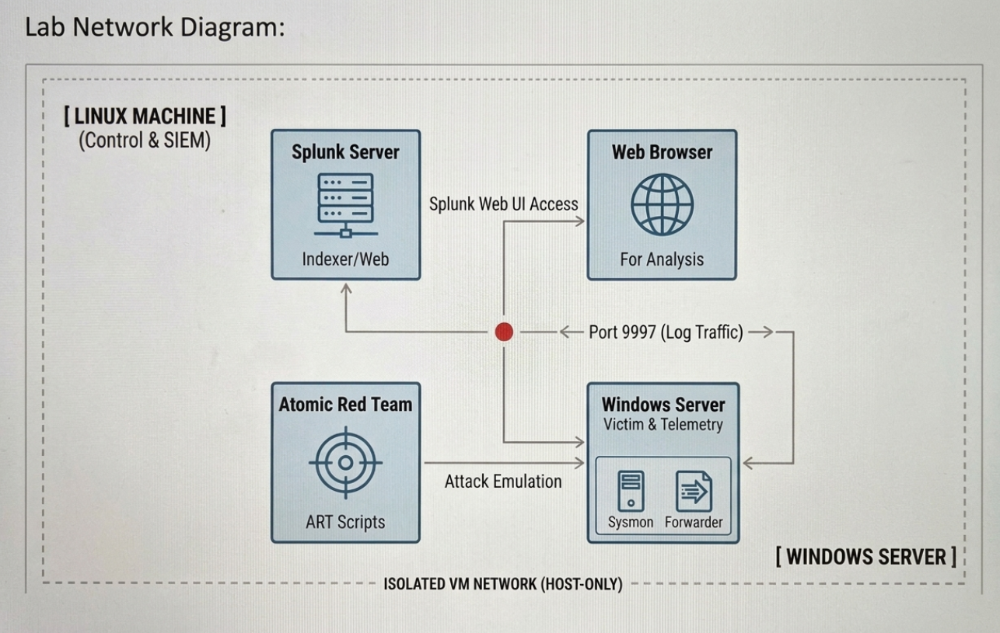

🛠️ Splunk Setup


1️⃣. Splunk Enterprise(Server) Installation Process :

a)​ First, I downloaded the .deb version for my Parrot OS from the website below


🔗 “https://www.splunk.com/en_us/download/splunk-enterprise.html?locale=en_us” 


b)​ Then installed Splunk Enterprise. I installed it by running the command
```bash
sudo dpkg -i splunk-10.2.3-4d61cf8a5c0c-linux-amd64.deb
```
& also changed the ownership of the Splunk installation directory & everything
inside it by the command. If there is any problem for the directory issue, then go to the root directory & apply it
```bash
sudo chown -R tanvir13:tanvir13 /opt/splunk.
```
The commands are in the snapshot
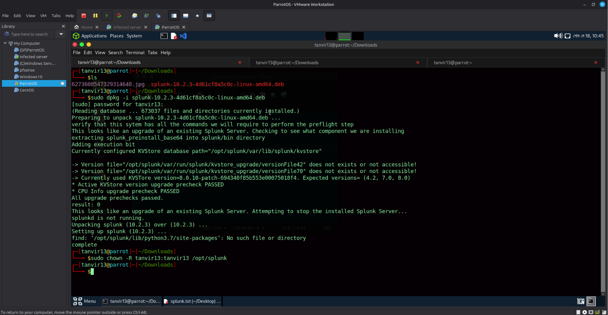


c) Then I went to the directory by running the command
```bash
cd /opt/splunk/bin
```

& started it by running the command
```bash
./splunk start
```
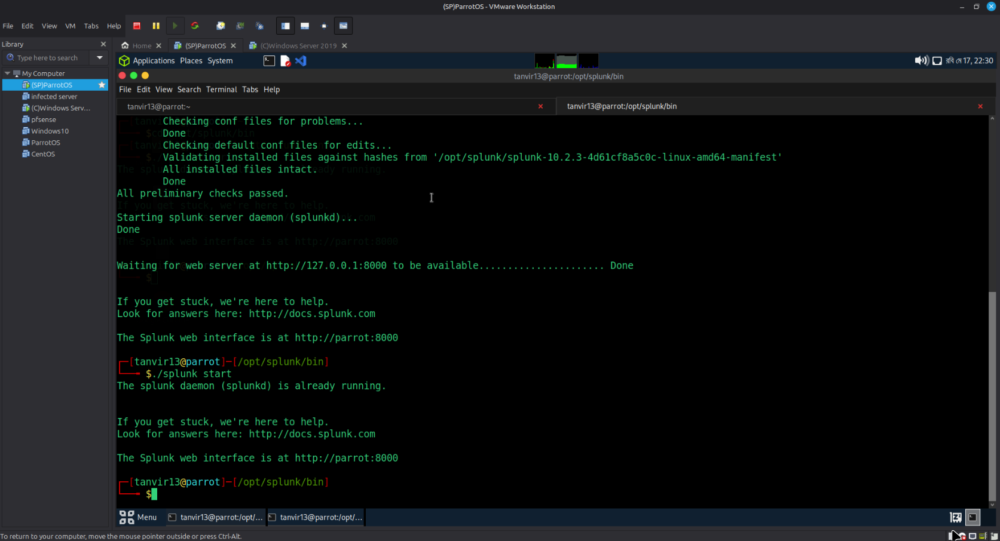

d) Then I copied the link address
```bash
http://parrot:8080
```
that I got from the CLI and pasted it into the Google browser.Then the address was sent to the Splunk Enterprise server interface.

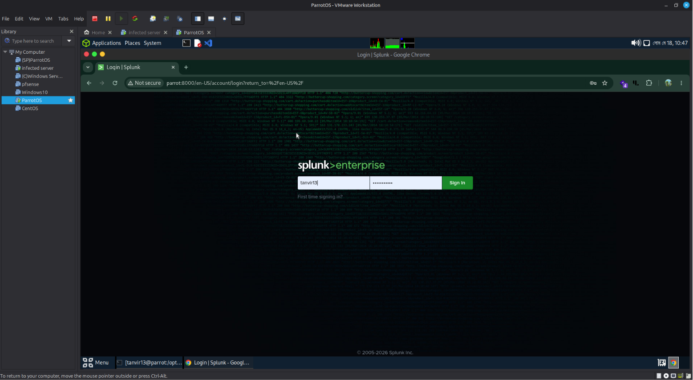

e) Then I typed the name & password & this interface was shown in the background.

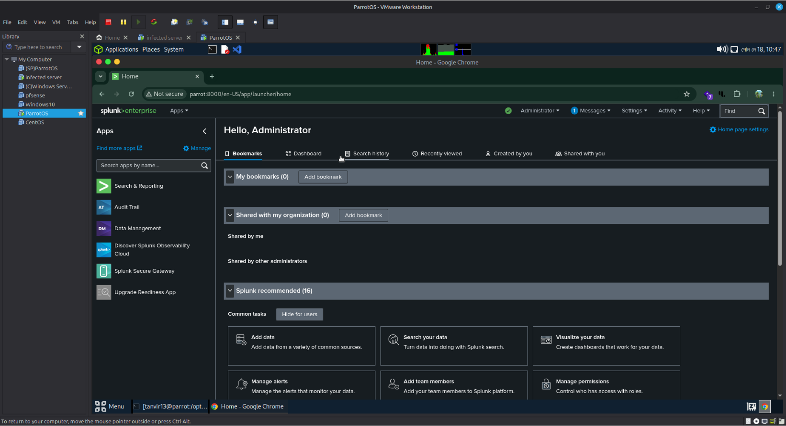

2️⃣. Splunk Universal Forwarder Installation Process:

a) I downloaded the Splunk universal forwarder .msi version for my Windows Server 2019 from this link

🔗 “https://www.splunk.com/en_us/download/universal-forwarder.html”

b) Then I downloaded an Add-on from this link for my Windows Server 2019

🔗 “https://splunkbase.splunk.com/app/742”

& I downloaded the 7-zip from this website 

🔗 “https://www.7-zip.org/download.html” 

to extract the Add-on file

c) Then I installed the Splunk forwarder. There are some snapshots from the time of installation of the forwarder. I marked the local system in the snapshot

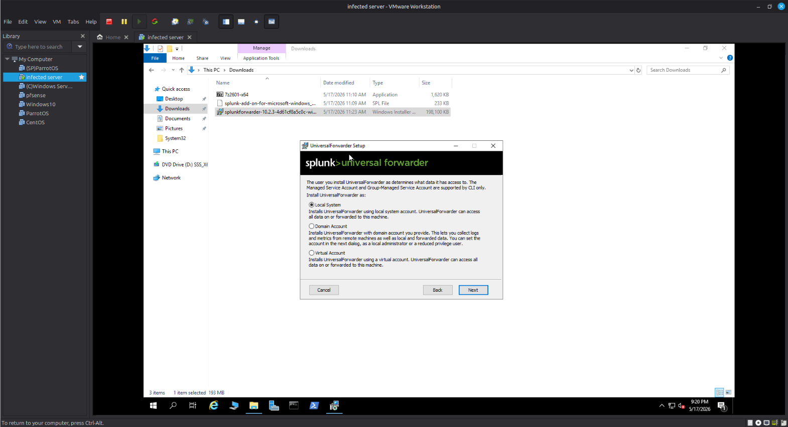

Then I typed the username & password

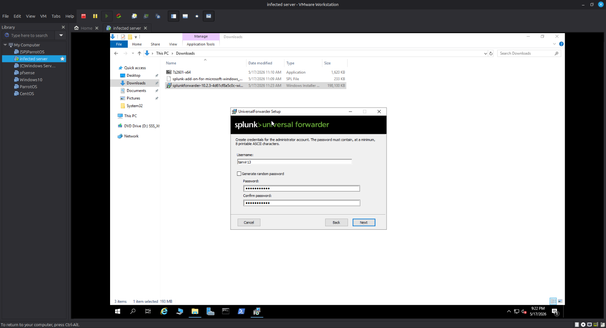

Then I typed the IP address of Windows Server 2019(192.168.159.138) & default port 8089 in the Deployment Server

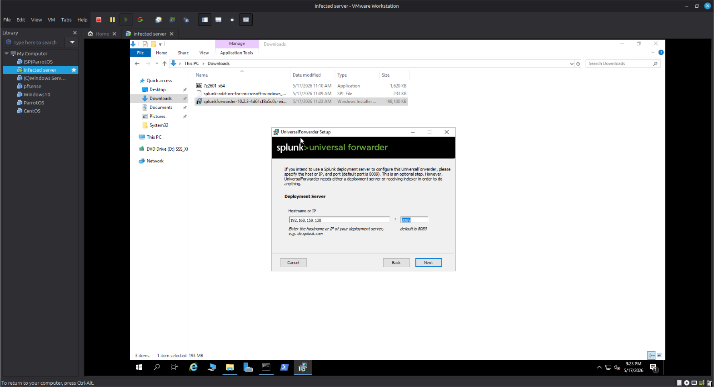

& I typed the same IP address & default port 9997 in the Receiving Indexer

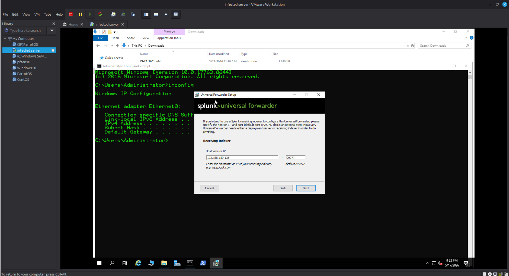

This is the location of Splunk Universal Forwarder on my Windows machine.

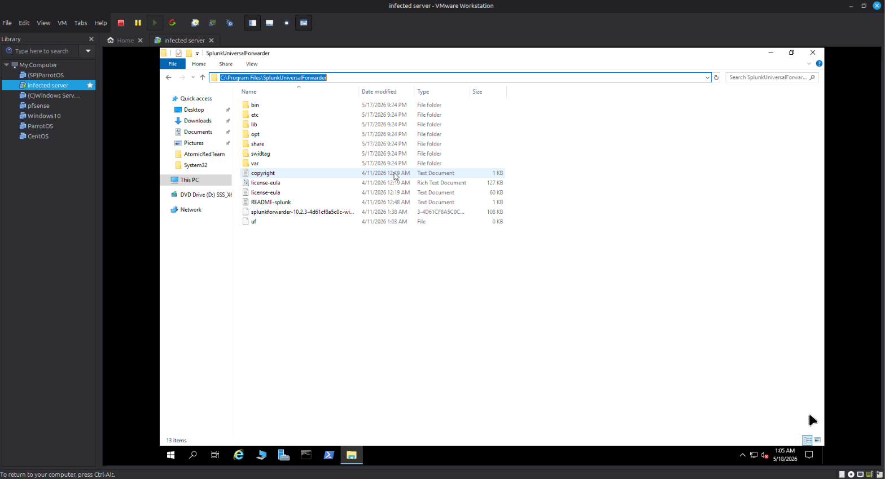

This is the Splunk Add-on & I extracted it with 7-Zip twice & finally, I got the Splunk_TA_windows-10.0.1 folder

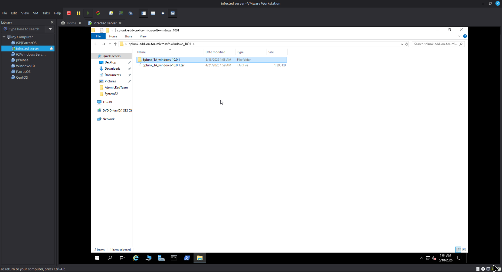


This is the inside of the Splunk_TA_windows-10.0.1 folder

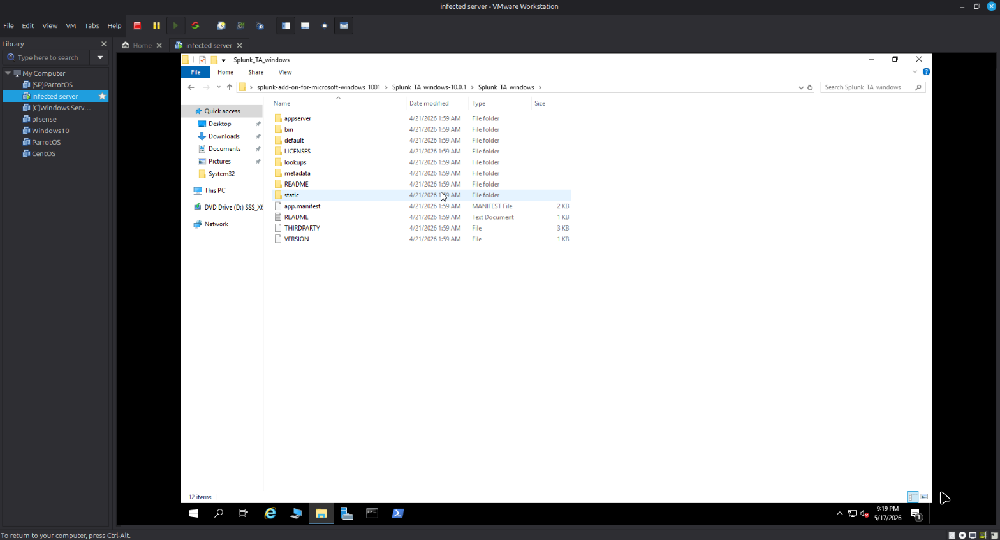

Here, I placed the Splunk_TA_windows-10.0.1 folder into the Splunk Forwarder

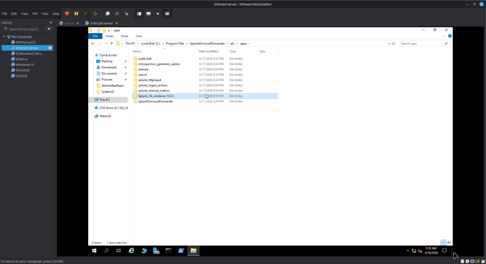

This is an inputs.conf

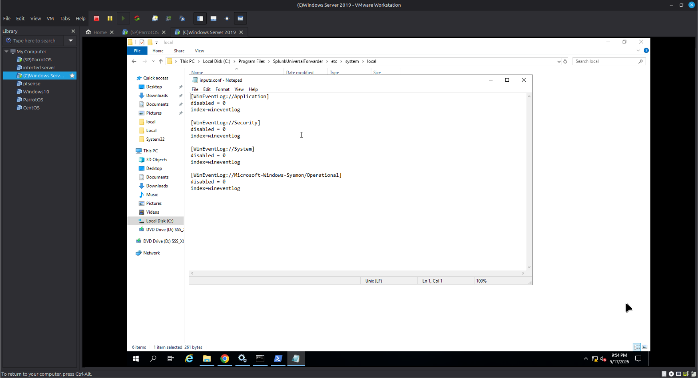

```bash
[WinEventLog://Application]
disabled = 0
index=wineventlog

[WinEventLog://Security]
disabled = 0
index=wineventlog

[WinEventLog://System]
disabled = 0
index=wineventlog

[WinEventLog://Microsoft-Windows-Sysmon/Operational]
disabled = 0
index=wineventlog
```

Or if the above don't work perfectly, we have to write more things in the inputs.conf file & in that case we have to create an extra limit.conf file

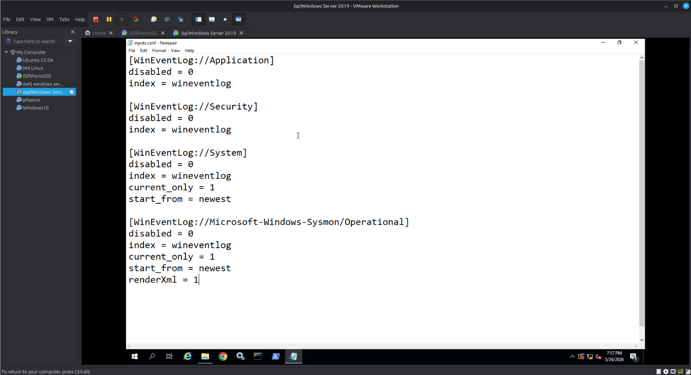

```bash
[WinEventLog://Application]
disabled = 0
index = wineventlog

[WinEventLog://Security]
disabled = 0
index = wineventlog

[WinEventLog://System]
disabled = 0
index = wineventlog
current_only = 1
start_from = newest

[WinEventLog://Microsoft-Windows-Sysmon/Operational]
disabled = 0
index = wineventlog
current_only = 1
start_from = newest
renderXml = 1
```

Here are the limits.conf file after writing extra in inputs.conf

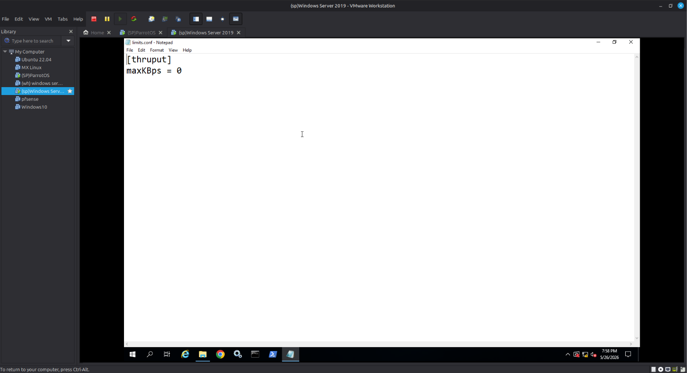

```bash
[thruput]
maxKBps = 0
```

This is deploymentclient.conf & where I typed the parrotOS(Splunk Enterprise(server)) IP(NAT) address (192.168.159.142)


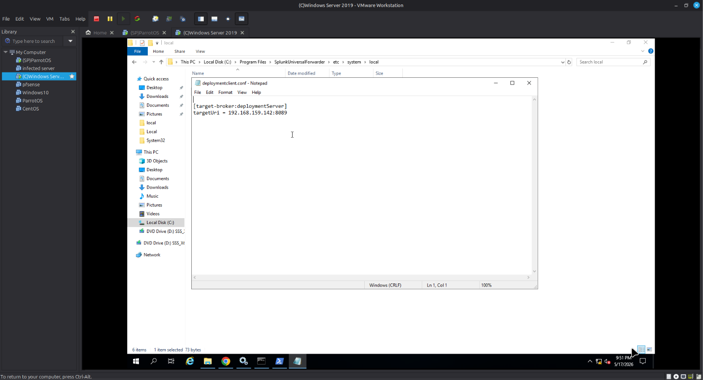

```bash
[target-broker:deploymentServer]
targetUri = 192.168.159.142:8089
```

This is outputs.conf & where I typed the parrotOS(Splunk Enterprise(server)) IP(NAT) address(192.168.159.142)

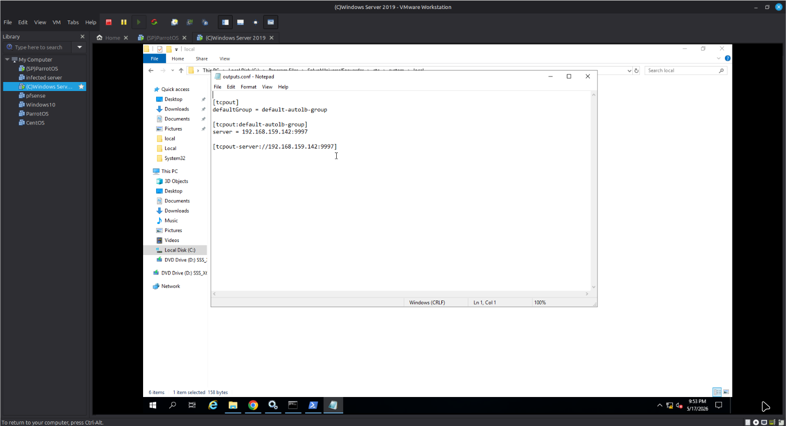

```bash
[tcpout]
defaultGroup = default-autolb-group

[tcpout:default-autolb-group]
server = 192.168.159.142:9997

[tcpout-server://192.168.159.142:9997]
```

I tested the connection between the (Windows Server 2019)Splunk Forwarder and (Parrot OS)Splunk Enterprise through the command in cmd &


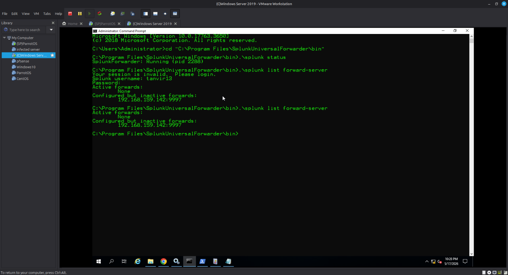


powershell


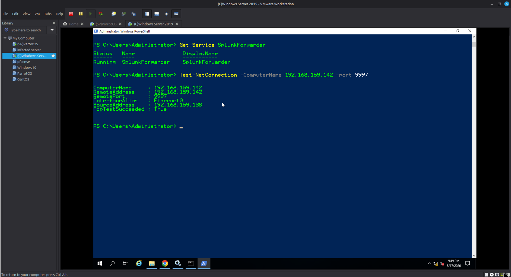


The command those are used to see the connection between the Splunk Enterprise (server) & splunk universal forwarder

i) going to the Splunk forwarder directory in the command

```bash
cd "C:\Program Files\SplunkUniversalForwarder\bin"
```
ii) to see the Splunk forwarder status in the command

```bash
.\splunk status
```

iii) to see the services of Splunk forwarder in PowerShell

```bash
Get-Service SplunkForwarder
```

iv) to test the connection in PowerShell

```bash
Test-NetConnection -ComputerName 192.168.159.142 -port 9997
```

v) to see the Splunk forward server in the command

```bash
.\splunk list forward-server
```
vi) Check what is happening on port 9997 in the Linux machine

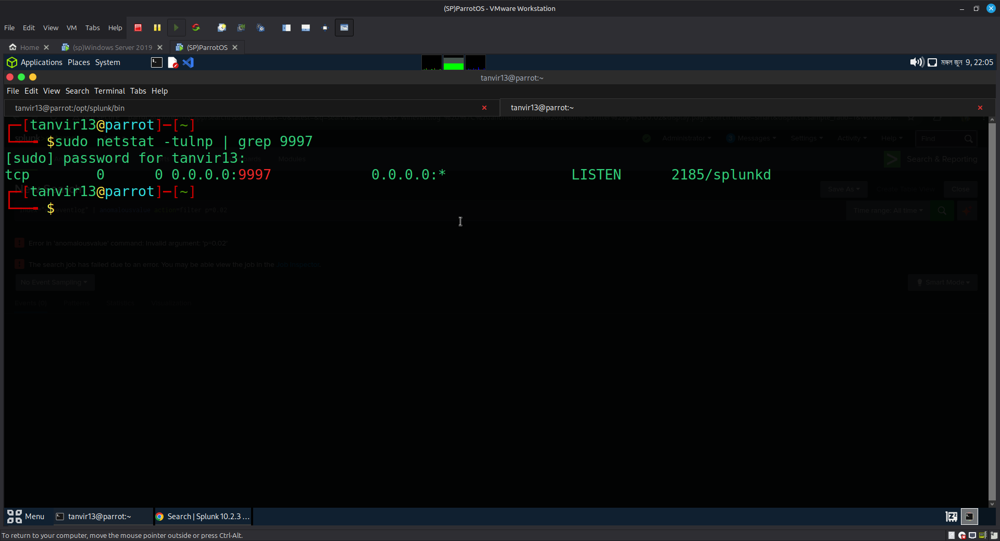

```bash
sudo netstat -tulnp | grep 9997
```

3️⃣. Sysmon Installation Process:

I downloaded the Sysmon from the link & extracted it

🔗 “https://learn.microsoft.com/en-us/sysinternals/downloads/sysmon” 

& sysmonconfig.xml file from the link, & placed it into the extracted Sysmon folder

🔗 “https://github.com/olafhartong/sysmon-modular/blob/master/sysmonconfig.xml”


I installed it with the

```bash
.\Sysmon64.exe -i .\sysmonconfig.xml
```

command & checked the sysmon with the command

```bash
Get-Service -Name Sysmon64
```

& it will run


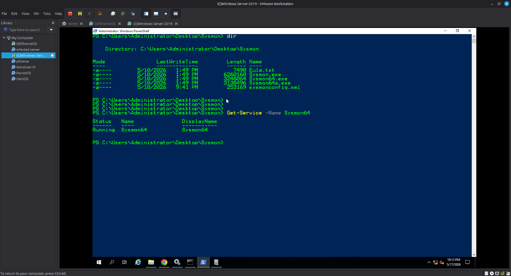

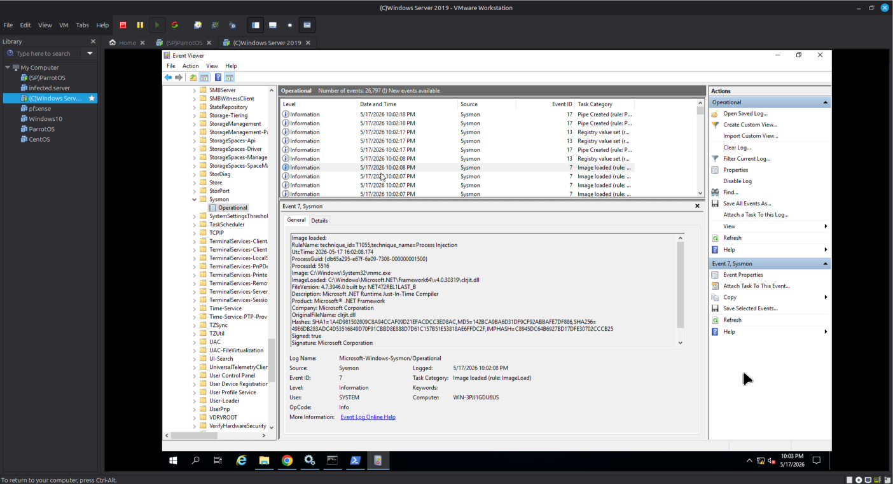

I also checked Sysmon through Splunk Enterprise

.png)

4️⃣. Showing Splunk Dashboard containing real-time logs from the Universal Forwarder Server.

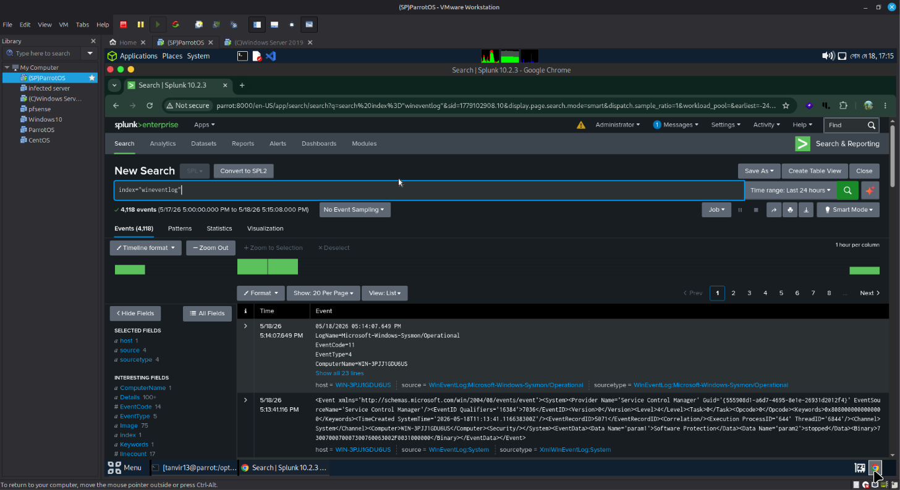


5️⃣. ART (Atomic Red Team) Installation process:

I turned off all of the windows' security system(virus & threat protection settings)

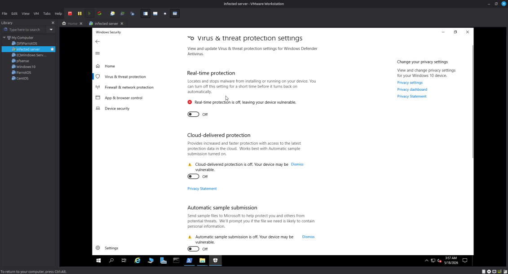


Then, I downloaded the zip file of atomic-red-team-master from the link

🔗 “https://github.com/redcanaryco/atomic-red-team”

& the zip file of invoke-atomicredteam-master from this link

🔗 “https://github.com/redcanaryco/invoke-atomicredteam” 

& Then I create a folder AtomicRedTeam in the local disk(C:)


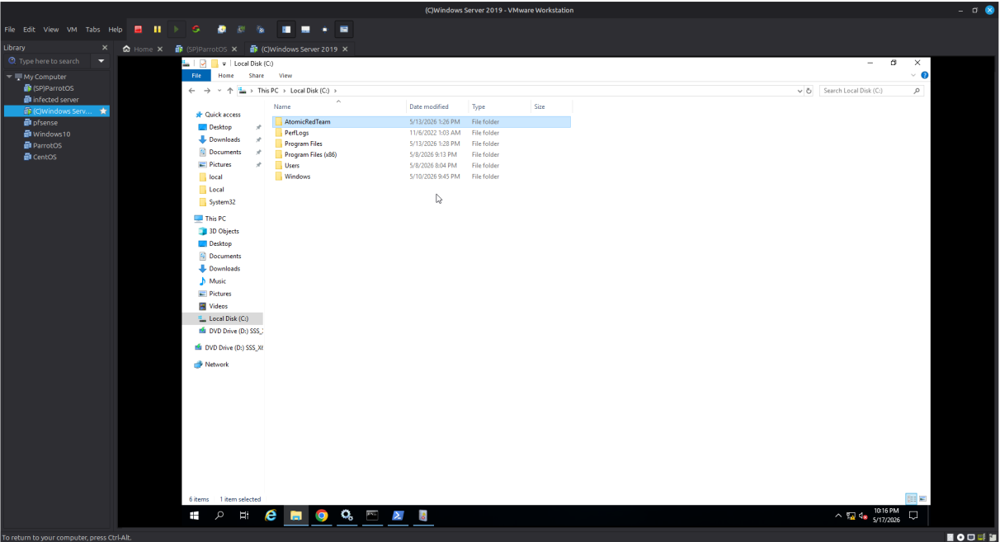


After the download, I unzipped those files & set the atomic-red-team-master folder & invoke-atomicredteam-master folder into the AtomicRedTeam folder.
Also sets the atomics folder into the AtomicRedTeam folder.

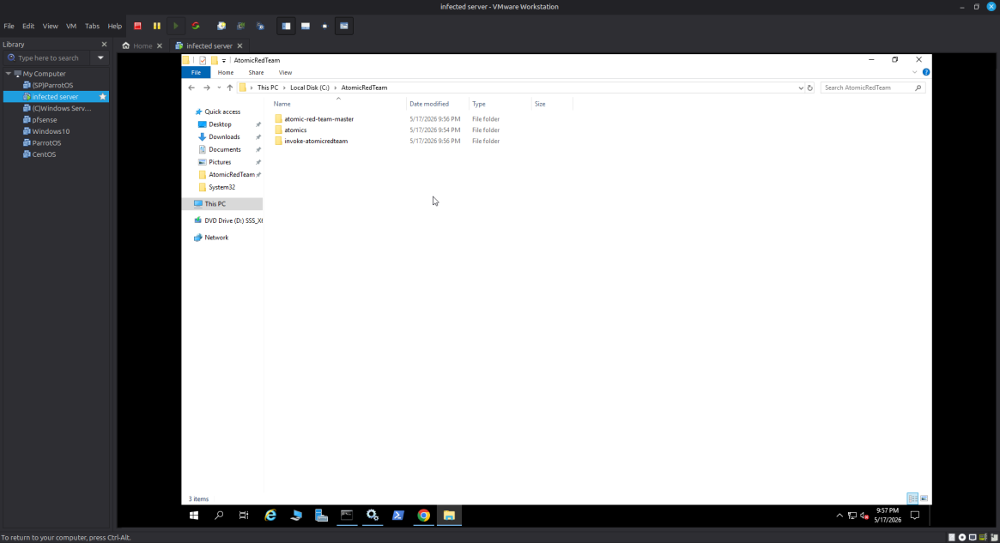


Then, I installed the AtomicRedTeam

i) 
```bash
powershell -exec bypass
```

ii)
```bash
Install-Module -Name invoke-atomicredteam,powershell-yaml -Scope CurrentUser
```

iii) 
```bash
Import-Module "C:\AtomicRedTeam\invoke-atomicredteam\Invoke-AtomicRedTeam.psd1" -Force
```

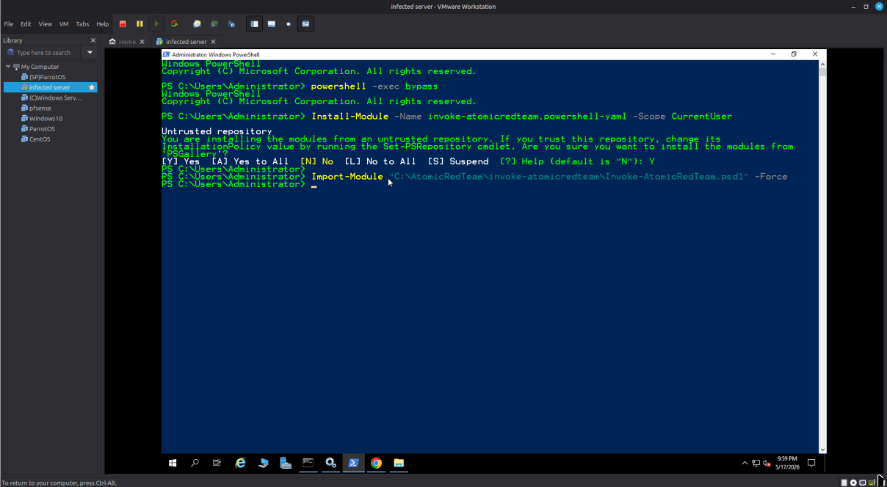


Then I test some AtomicRedTeam Attack simulation with the command

i)

```bash
Invoke-AtomicTest T1016 -ShowDetailsBrief
```

ii)
```bash
Invoke-AtomicTest T1055 -ShowDetailsBrief
```

iii)
```bash
Invoke-AtomicTest T1570 -ShowDetailsBrief
```


iv)
```bash
Invoke-AtomicTest T1020 -ShowDetailsBrief
```

v)
```bash
Invoke-AtomicTest T1030 -ShowDetailsBrief
```
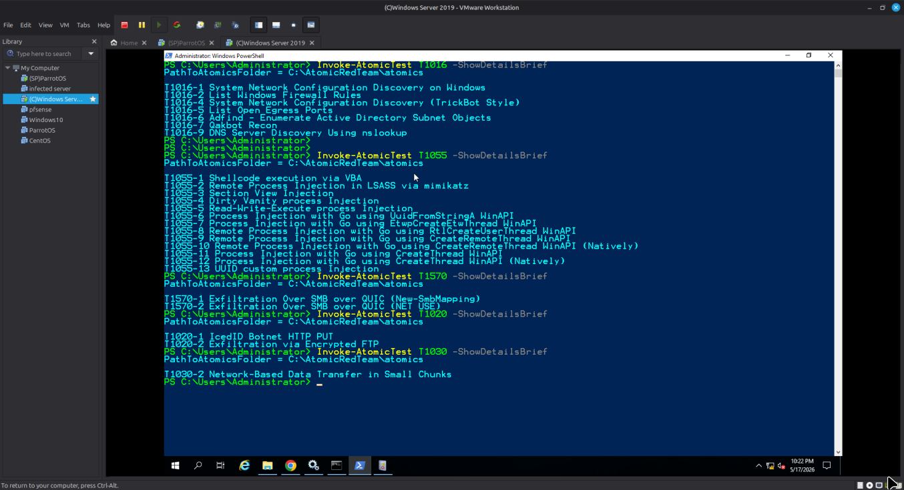
